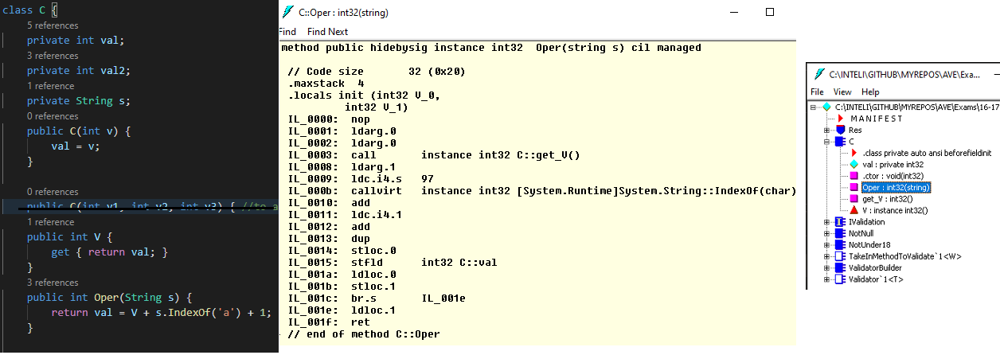

## Group 1 (V e F / True and false)
## 1
**a. F**, All types extend from object. So, all times can override ToString(), GetType(), GetHashCode() and Equals() per example

**b. V**, Since value types extend from object, a boxing conversion occurs.

In IL:
```
ldc.i4.s 10
box [System.Runtime]System.Int32
stloc.0
```

**c. F**, If IEnumerable is generic in T, class C should also add the generic type T, but it's just W. Class A should start with:
- class C<W,T>

Plus, class C doesn't implement the interface method GetEnumarator()

**d. V**, typeof() returns an object of type Type. Thus, getting the type of the type using GetType() will return Type. Thus, the expression is true.

## 2
Soon(materia nao dada)

## 3

*Se viste a aula de res de exercicios vais ver q eles meteram tudo isto a falso, mas acho que se enganaram ou entao nao perceberam a propria pergunta tenho quase a certeza. De maneira nenhuma que acrescetar mais instruçoes e dados nao aumenta o espaço de um objeto...*

**a. V** More data = more bytes = more space. Properties, internally, are also fields, which occupy memory. And for each of these properties, there's also going to be created (implicitly, or explicitly: if the programmer so desires do make his own setters and getters) methods(at compile time by the compiler) in order to produce the IL code(which is also data) that will be common to all instances. The only thing that isn't common between instances are the fields and its values. Methods are common.

**b. V** More data = more bytes

**c. F** This question doesn't even make sense. And the number of instances there are of an class doesn't effect the size of other instances

**d. V** More data = more bytes. If we change the definition of the class by adding more functionality(which are instructions), ALL instances of that class will occupy more memory. Methods make up IL code with takes up memory

## 4
**a. F** Custom attributes are metadata, it doesn't affect the instance of a class

**b. V** They can be instantiated just like any class

**c. F** You can't create constructors with delegates

**d. F** Depends on the definition of the custom attribute. Specificaly, on in own custom attribute
```csharp
[AttributeUsage(AttributeTargets.Class |  AttributeTargets.Method)]
```
## 5
IDK if this is correct...
```csharp
public static Dictionary<K, List<E>> CollectBy<K,E>(List<E> src, Func<E,K> toKey, Func<E, E> toElem){
        Dictionary<K, List<E>> res = new Dictionary<K, List<E>>();
        foreach(E item in src) {
            K key = toKey(item); //toKey receives "item", and its part of src(item in src), thus they have the same type
            List<E> elems;
            if(!res.TryGetValue(key, out elems)) { 
                elems = new List<E>(); res[key] = elems; 
            }
            elems.Add(toElem(item));
        }
        return res;
}
```

## [6](https://github.com/p4ulor/AVE/tree/main/Exams/16-17-sem2-teste1/Res/EX6) In folder EX6 

## 7
1. Create class
2. dotnet build(in the Res folder)
3. Go to Res\bin\Debug\net5.0
4. Open Res.dll with ildasm.exe


- Note, ld -> load -> push(into the evaluation stack). st -> store(stores a value locally to the method) -> pop. br -> branch AKA jump
### Answer:
```csharp
ldarg.0    //loads reference to *this* ,(evalatuation) stack: this.
ldarg.0    //loads reference to *this*, stack: this, this.
call       instance int32 C::get_V() //first reference is used here, returns an int, stack: int, this.
ldarg.1    //stack: string, int, this
ldc.i4.s   97 //stack: int, string, int, this

//the next instruction consumes the int at the top of the stack(97) and the string, at s.IndexOf('a')
callvirt   instance int32 [System.Runtime]System.String::IndexOf(char)//stack: int, int, this
add        //consumes the 2 values at the top and places the result on top, stack: int, this
ldc.i4.1   //load constant insteger 4bytes(32bits) of value 1, stack: int, int, this
add        //stack: int, this
dup        //Copies the current topmost value on the evaluation stack, and then pushes the copy onto the evaluation stack. Because we will store this result(val =) AND return the same result and each of this operations pops from the stack the result
//         stack: int, int, this
stloc.0    //store in local variable the result, stack: int, this
stfld      int32 C::val //write to instance field: stack:
ldloc.0    //load the local variable where the result was stored, stack: int
stloc.1    //store it in variable 1
br.s       IL_001e //unnecessary branch, but used for debugging purposes 
IL_001e : ldloc.1
ret
```
[About the unnecessary branch](https://stackoverflow.com/questions/26323373/why-is-the-br-s-il-opcode-used-in-this-case)

### Clean answer:
```csharp
ldarg.0    
ldarg.0    
call       instance int32 C::get_V() 
ldarg.1    
ldc.i4.s   97 
callvirt   instance int32 [System.Runtime]System.String::IndexOf(char)
add        
ldc.i4.1   
add        
dup        
stloc.0    
stfld      int32 C::val 
ldloc.0    
ret
```

## 8

## 9
Soo(materia nao dada)